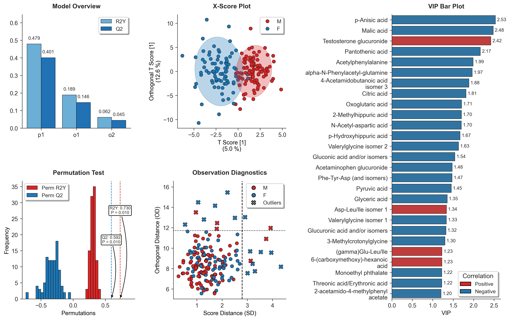

# π-OPLS-DA (`pi-oplsda`)

[](https://github.com/KaikunXu/pi-oplsda/releases)
[](https://opensource.org/licenses/MIT)


> A high-performance, Pythonic implementation of Orthogonal Partial Least Squares Discriminant Analysis (OPLS-DA), tailored for metabolomics and bioinformatics.

`pi-oplsda` bridges the gap between the rigorous algorithmic foundation of the gold-standard R package `ropls` and the modern Python data science ecosystem. It delivers blazing-fast parallel computing, native Pandas integration, and publication-ready visualizations—all in one lightweight package.

##  ✨ Core Capabilities

+ **Standardized Rigor:** Perfectly replicates `ropls` step-wise variance increments ($R^2X$, $R^2Y$, $Q^2$) and NIPALS-based orthogonal signal correction (OSC).
+ **Pandas Native:** Seamlessly feed `pandas.DataFrame` into the model. Sample IDs and feature names are automatically tracked, eliminating the need for tedious matrix index management.
+ **Multi-Core Acceleration:** Powered by `joblib`, permutation tests are fully parallelized.
+ **Publication-Ready Graphics:** Built on `matplotlib` and `seaborn` to generate clean, high-resolution diagnostic plots with smart legend placement. 
+ **Structured Export:** Extract model parameters, sample scores, and biomarker statistics (VIP, Covariance, Correlation) as instantly usable DataFrames for downstream pipelines.

##  ✅ Mathematical Equivalence & Benchmarking

`pi-oplsda` is strictly validated against the gold-standard R package `ropls` (Bioconductor) to ensure scientific integrity. Our cross-platform benchmarking demonstrates that `pi-oplsda` produces numerically identical results across all key OPLS-DA metrics.

Using the **Sacurine** human urine dataset (183 samples, 109 metabolites), we compared the Python and R implementations:

| Metric | Description | Correlation or Difference |
| :--- | :--- | :--- |
| **Global Quality** | Cumulative $R^2X$, $R^2Y$, and $Q^2$ | **Identical** |
| **Error Assessment** | Root Mean Square Error of Estimation (RMSEE) | **Identical** |
| **Latent Space** | Predictive Scores ($t_1$, $o_{n}$) and Loadings ($p_1$) | **> 0.999** |
| **Variable Importance** | Variable Importance in Projection (VIP) scores | **> 0.999** |


> **Note:** Due to the nature of eigen-decomposition, the signs of scores and loadings may be flipped between platforms. This is mathematically equivalent and does not affect biological interpretation.

##  📦 Installation
You can install `pi-oplsda` using either of the following methods, depending on whether you simply want to use the package or if you plan to modify the source code.

Option 1: Install directly from GitHub (Recommended for most users)

```bash
pip install git+https://github.com/KaikunXu/pi-oplsda.git
```

Option 2: Install from source (For developers)

If you want to contribute to the project, modify the algorithm, or explore the source code, you can clone the repository and install it in "editable" mode. This means any changes you make to the local code will immediately take effect without needing to reinstall the package.

```bash
# 1. Clone the repository
git clone https://github.com/KaikunXu/pi-oplsda.git

# 2. Navigate into the project directory
cd pi-oplsda

# 3. Install in editable mode
pip install -e .
```

##  🚀 Quickstart & Tutorials
We provide interactive Jupyter Notebooks that walk you through the entire OPLS-DA workflow and our rigorous validation process:

* **[Quickstart Tutorial](examples/quickstart_en.ipynb)**: A comprehensive guide from data loading to visualization and prediction.
* **[R-ropls Equivalence Benchmark](examples/equivalence_benchmark.ipynb)**: The complete script used to prove numerical consistency between Python and R implementations.

## 📈 Generated Diagnostic Plots

<p align="center">
  
</p>

Running the `OPLSDA_Visualizer` will automatically generate a suite of tightly integrated diagnostic subplots to evaluate your model from multiple dimensions:

+ **Model Overview:** Displays the step-wise increments of $R^2Y$ and $Q^2$ for both predictive and orthogonal components, illustrating the model's global explanatory and predictive capacity.
+ **X-Score Plot:** Visualizes sample clustering and separation in the predictive latent space, complete with 95% Hotelling's $T^2$ confidence ellipses.
+ **Observation Diagnostics:** Evaluates the relationship between sample influence (Score Distance) and model fit (Orthogonal Distance / DModX) to robustly identify multivariate outliers.
+ **Permutation Test:** Validates model robustness against overfitting by comparing the original $R^2Y$ and $Q^2$ against permuted null distributions, providing empirical p-values.
+ **VIP Bar Plot:** Ranks the top features contributing to group separation. It features **automatic text wrapping** for excessively long metabolite names on the Y-axis to ensure clean, publication-ready layouts.
+ **S-Plot (Optional):** Highlights potential biomarkers based on the interplay between covariance (magnitude) and correlation (reliability). *(Note: This plot is available exclusively for binary classification models, as demonstrated in the Quickstart Tutorial).*

## 🤝 Acknowledgements

The algorithmic foundation of `pi-oplsda` is deeply inspired by the excellent R package [`ropls`](https://bioconductor.org/packages/ropls/).

> **Note:** Portions of this codebase, including code refactoring and documentation, were refined with the assistance of Gemini 3.1 Pro. All AI-assisted contributions have been strictly reviewed by the human author to ensure scientific accuracy and code quality.

## 🛠 Contributing

Contributions, issues, and feature requests are welcome! Feel free to check the [issues page](https://github.com/KaikunXu/pi-oplsda/issues).

## 📄 License

This project is licensed under the **MIT License**.
